# Archify PR #625 — review evidence / 审查证据

Candidate: `c45ea534a405303890f4795e03412cffb849b1a8`
Comparison base (#615): `6bc47e51fc95c153a71e36df411546ef60d3908d`

[Download standalone HTML + screenshots (ZIP)](downloads/pr625-visual-evidence-c45ea53.zip) · [SHA-256](downloads/pr625-visual-evidence-c45ea53.zip.sha256) · [Visual review and reproduction](visual/README.md) · [Verification results](verification-summary.md)

This evidence branch contains review artifacts only. The lifecycle source remains in [PR #625](https://github.com/tt-a1i/archify/pull/625); the development identity dependency is [PR #615](https://github.com/tt-a1i/archify/pull/615). Download and extract the ZIP, then open `index.html` or any standalone diagram HTML locally. Each diagram can switch between light and dark themes.

本分支仅保存审查材料，不向功能 PR 混入截图与下载包。固定三个输入，修复前后使用相同的 1440×900 / DPR 1 / 100% 缩放、Classic、READ、静止动画环境。6个独立HTML、24张截图，其中12张1440×900图已经逐张查看；2048×1320仅作为补充材料。没有编辑截图，也没有改写输入来美化结果。工具自动回执中的 pending 保持不变，Codex的实际逐图观察另存 visual-review.json，维护者批准仍待进行。

## Before / after at 1440×900

Click an image for its original dimensions. All cases preserve node rectangles, relationship identities and the viewBox. The dense case covers the initial-state dot/arrow; none of these synthetic inputs contains transition labels.

### Minimal six return relationships

| Theme | Before | After |
| --- | --- | --- |
| light | 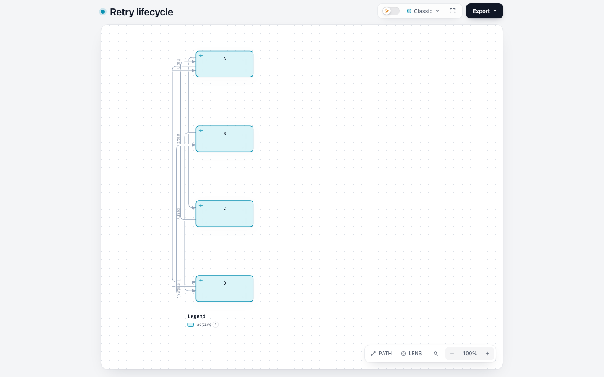 | 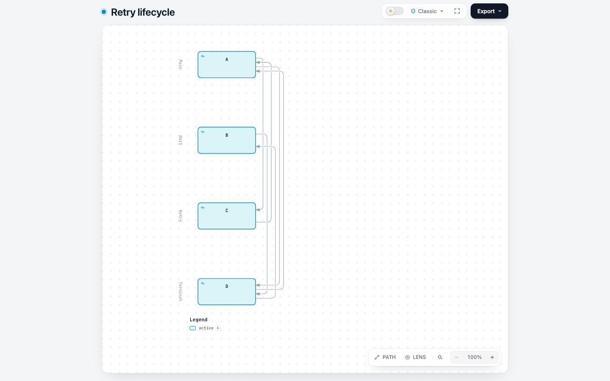 |
| dark | 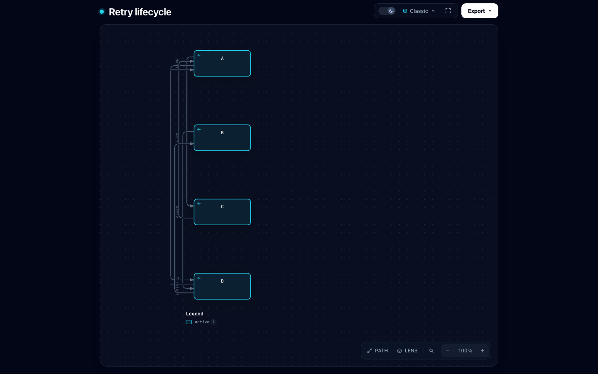 | 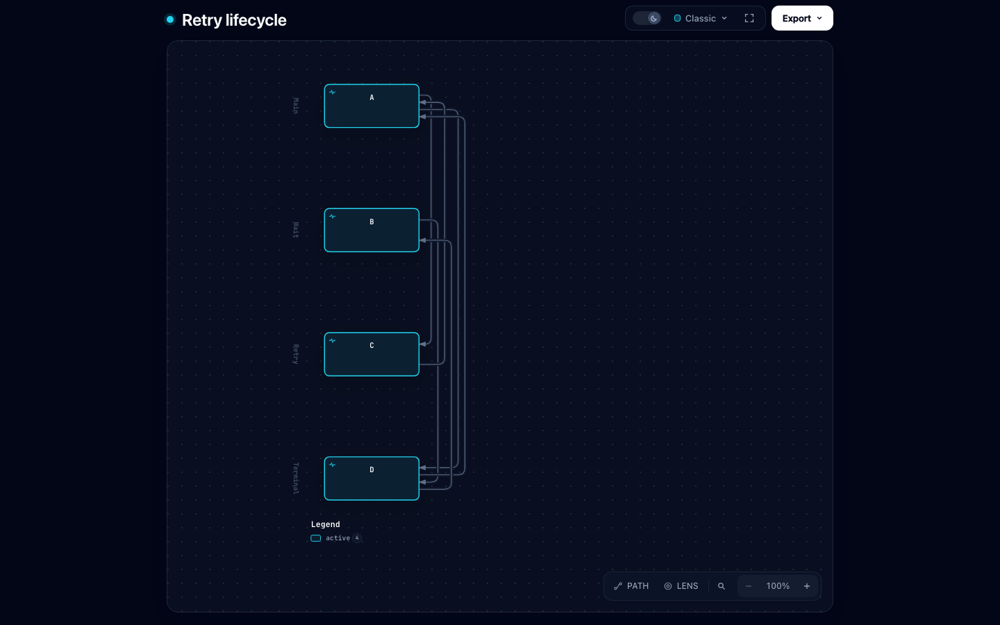 |

### Dense ten relationships and initial marker

| Theme | Before | After |
| --- | --- | --- |
| light | 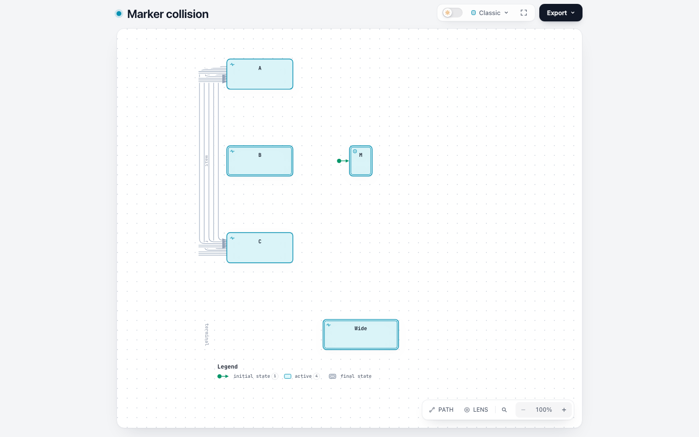 | 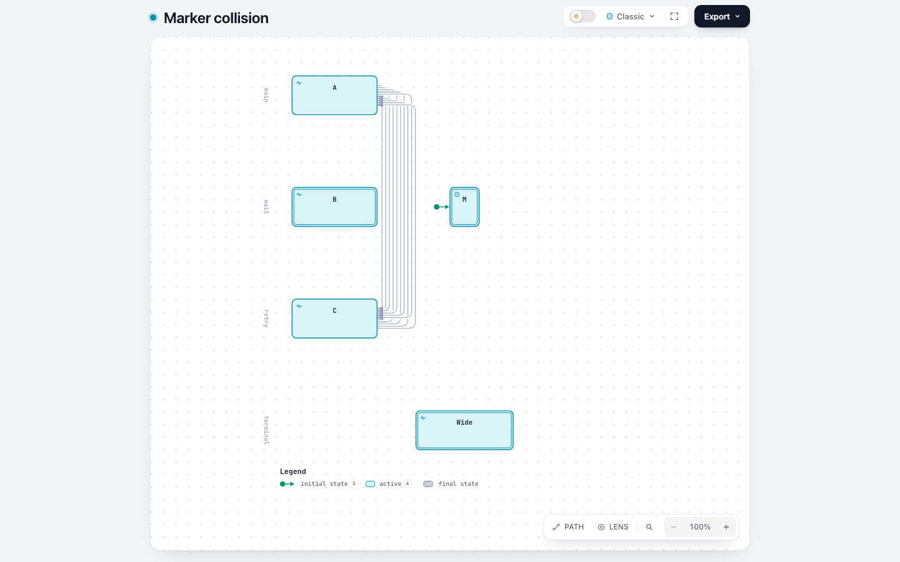 |
| dark | 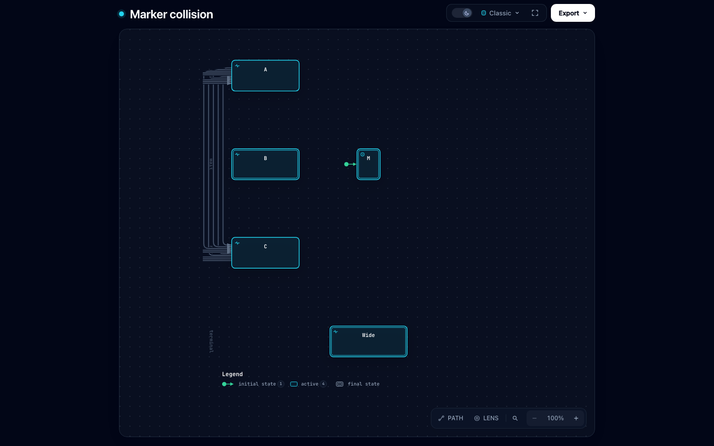 | 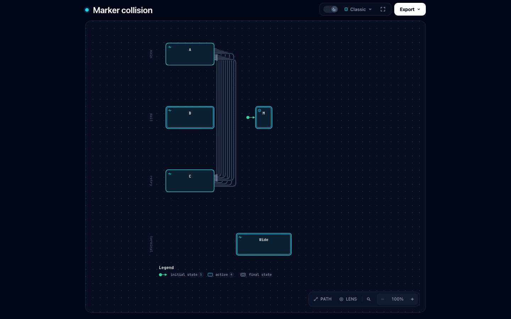 |

### Wider intermediate state

| Theme | Before | After |
| --- | --- | --- |
| light | 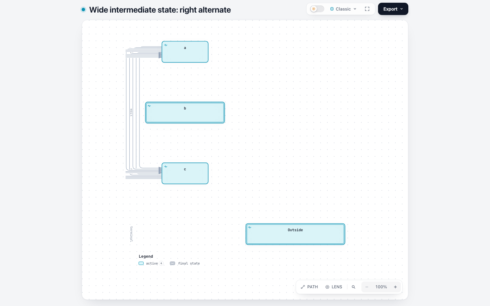 | 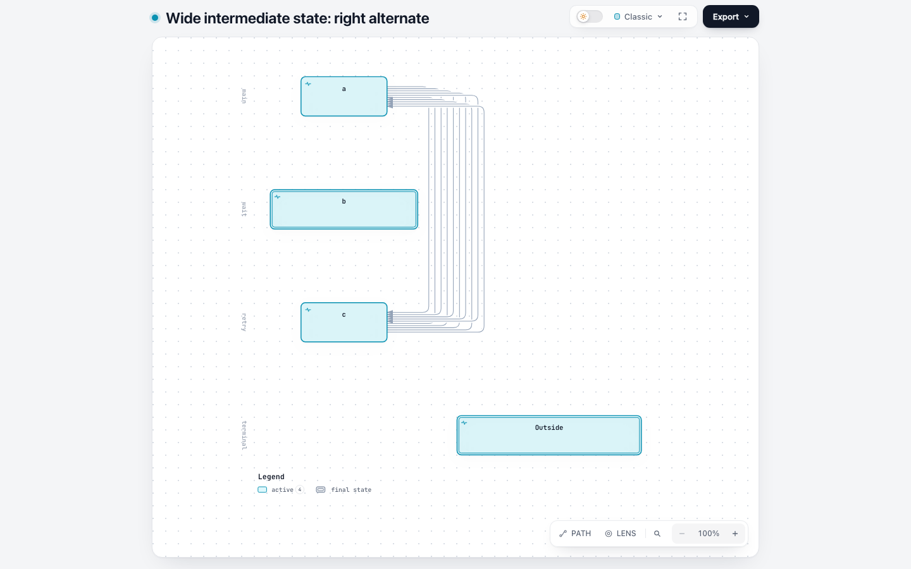 |
| dark | 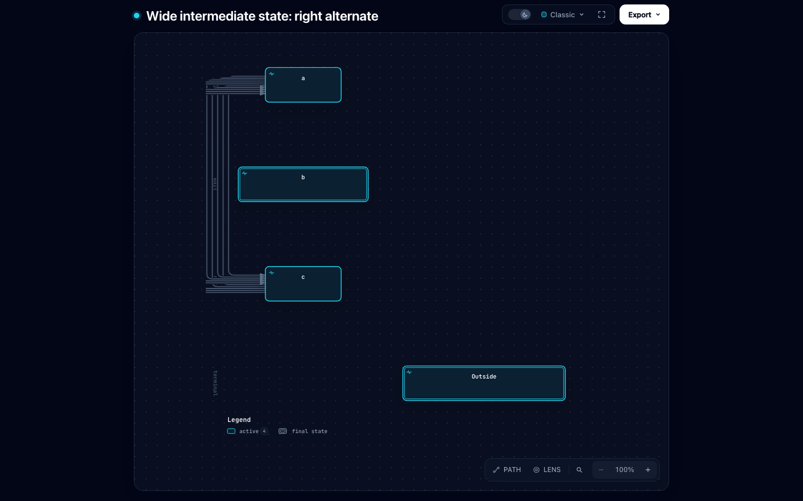 | 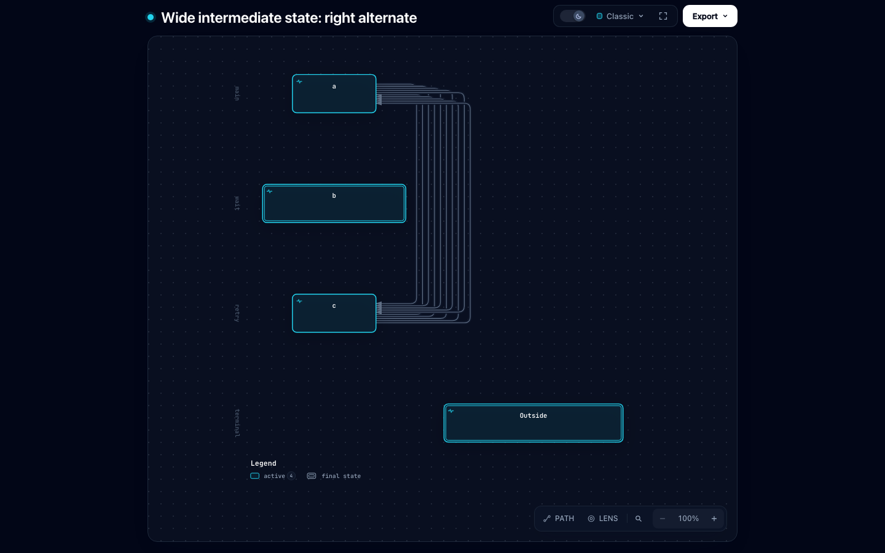 |
